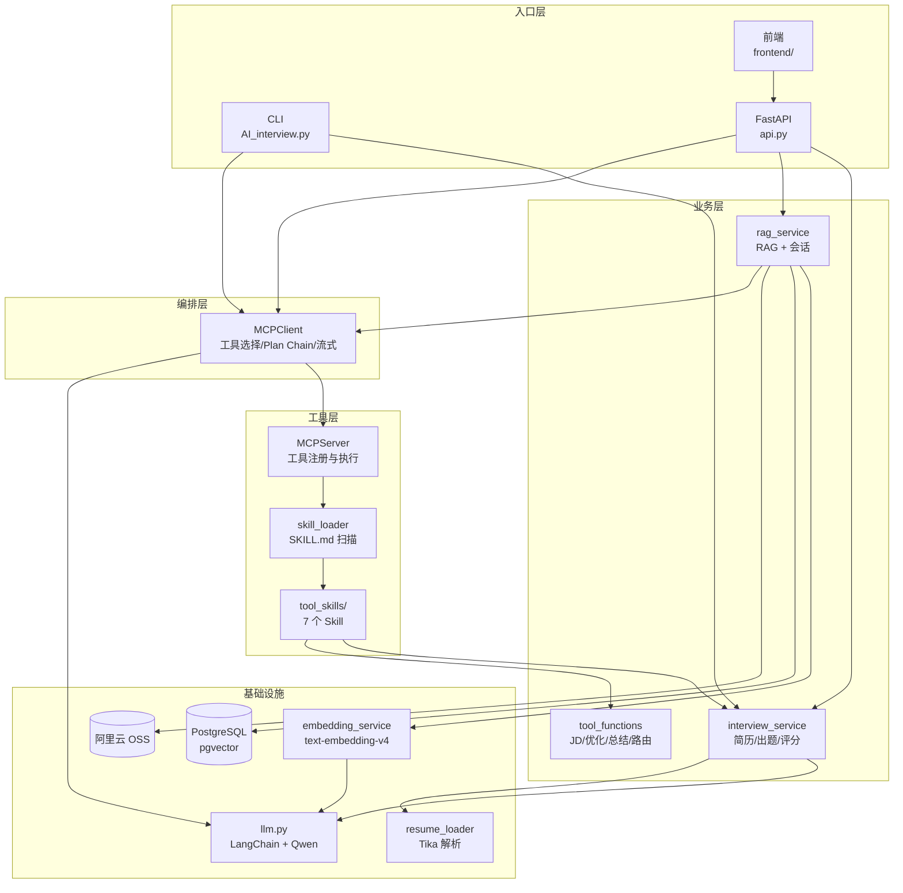

# easy-langent 项目学习文档

**easy-langent** 是一个基于 Python 的 **AI 智能面试辅助平台**，核心能力分三条业务线：

| 业务线               | 做什么                           | 典型用户场景                     |
| -------------------- | -------------------------------- | -------------------------------- |
| **基于简历模拟面试** | 解析简历 → 生成面试题 → 评估回答 | 候选人自测、面试官备课           |
| **知识库 RAG**       | 上传文档 → 向量化 → 语义检索问答 | 企业内部技术文档问答             |
| **MCP 智能助手**     | LLM + 工具调用，按需执行 Skill   | 「帮我分析简历并出题」一句话完成 |

项目支持三种使用方式：

- **CLI 命令行**：`python src/AI_interview.py`
- **REST API**：`api.py`（FastAPI）或 `local_dev_server.py`（轻量 HTTP）
- **Web 前端**：`frontend/`（Vue 3 + 原生 JS）

核心业务代码全部在 **`src/ai_interview/`**。

---

## 2. 业务开发思想

### 2.1 分层思想：先业务，再 Agent，再接口

本项目不是「一上来就写 Agent」，而是按层次递进：

```
第 1 层：原子业务能力（interview_service.py）
         analyze_resume / generate_questions / evaluate_answer
              ↓
第 2 层：工具注册与 Skill 配置（mcp_server + skill_loader + tool_skills/）
              ↓
第 3 层：Agent 编排（mcp_client：工具选择 + Plan Chain）
              ↓
第 4 层：RAG 增强（rag_service：检索 + 工具融合）
              ↓
第 5 层：对外接口（api.py / CLI / 前端）
```

**为什么要这样分层？**

- 每个 Skill 都可以**单独测试**，不依赖 LLM 选工具；
- 新增能力只需加 `SKILL.md`，不必改 Agent 核心逻辑；
- API 层只做参数校验和路由，业务逻辑不散落在 Controller 里。

### 2.2 Skill 驱动：配置优于硬编码

新增一个面试相关能力（如「JD 解析」），标准做法是：

1. 在 `tool_functions.py` 写纯函数；
2. 在 `tool_skills/xxx/SKILL.md` 写 YAML 元数据（name、description、func、parameters）；
3. 重启服务，MCP Server 自动扫描注册。

**不需要改** `mcp_server.py`、`api.py` 的路由代码。

### 2.3 调用层约束：不完全信任 LLM 自主规划

大模型自由 Function Calling 时，可能出现：

- 先调用「出题」、后调用「简历分析」，导致题目与简历无关；
- JSON 输出不稳定，解析失败。

因此项目采用 **双层保障**：

| 问题         | 策略                                                         |
| ------------ | ------------------------------------------------------------ |
| JSON 不稳定  | 关闭 thinking + Prompt 约束 + `extract_json_object` 容错解析 |
| 工具顺序错乱 | 检测到固定组合（如 analyze + generate）时走 **Plan Chain** 按优先级顺序执行 |
| 工具选错     | LLM 路由 + 关键词兜底（`select_skill_names`）                |

### 2.4 存储双轨：热数据本地，冷数据持久化

| 数据         | 存储位置                                  | 用途               |
| ------------ | ----------------------------------------- | ------------------ |
| 知识库元数据 | `.rag_data/state.json`                    | 快速列表、本地开发 |
| 向量与分块   | PostgreSQL + pgvector                     | 语义检索           |
| 原始文件     | 阿里云 OSS（或本地 `.rag_data/objects/`） | 文件归档           |
| 会话历史     | PostgreSQL `conversation` 表              | 多轮对话持久化     |

向量检索失败时，自动 **降级** 到本地关键词打分，保证开发环境可用。

### 2.5 接口设计：同步 + 流式并存

- **同步接口**：面试启动、单题评分、知识库上传（`/api/interview/*`）
- **流式接口**：助手对话（`/api/assistant/chat/stream`，SSE 推送）

流式事件协议：

```
event: meta     → 状态（retrieving / answering / thinking）
event: sources  → 检索到的知识库片段
event: tool     → 工具调用过程
event: delta    → LLM 逐字输出
event: done     → 最终结果 + conversation_id
event: error    → 错误信息
```

---

## 3. 整体架构



---

## 4. 理解顺序

### 阶段 0：环境准备（0.5 天）

| 步骤 | 做什么                                 | 涉及技术         |
| ---- | -------------------------------------- | ---------------- |
| 0.1  | 安装 Python 3.10+、创建虚拟环境        | venv             |
| 0.2  | `pip install -r requirements.txt`      | pip              |
| 0.3  | 安装 Java（Tika 解析 PDF 需要）        | JDK              |
| 0.4  | `docker compose up -d` 启动 PostgreSQL | Docker, pgvector |
| 0.5  | 配置环境变量 `AI_BAILIAN_API_KEY`      | DashScope API    |

### 阶段 1：LLM 基础层

| 顺序 | 读什么                     | 学习目标                                   |
| ---- | -------------------------- | ------------------------------------------ |
| 1.1  | `config.py`                | 理解配置加载、环境变量占位符               |
| 1.2  | `llm.py`                   | 理解 Prompt 构建、JSON 提取、thinking 关闭 |
| 1.3  | 手动调用 `invoke_llm_json` | 跑通一次 LLM 调用                          |

**本阶段技术栈：** LangChain Core、LangChain OpenAI、python-dotenv、PyYAML

### 阶段 2：文档解析 + 面试原子能力

| 顺序 | 读什么                         | 学习目标                     |
| ---- | ------------------------------ | ---------------------------- |
| 2.1  | `resume_loader.py`             | Tika 解析、文本清洗          |
| 2.2  | `interview_service.py`         | 简历分析、出题、评分三个函数 |
| 2.3  | `cli.py` + `conduct_interview` | 跑通 CLI 交互式面试          |

**本阶段技术栈：** Apache Tika、正则清洗、结构化 JSON Prompt

**验证命令：**

```bash
cd F:\PythonProject\easy-langent
python src/AI_interview.py
# 选择 2) 交互式面试
```

### 阶段 3：MCP 工具框架

| 顺序 | 读什么                   | 学习目标                           |
| ---- | ------------------------ | ---------------------------------- |
| 3.1  | `tool_skills/*/SKILL.md` | 理解 Skill 配置格式                |
| 3.2  | `skill_loader.py`        | YAML 解析、工具路由                |
| 3.3  | `mcp_server.py`          | 工具注册与懒加载                   |
| 3.4  | `mcp_client.py`          | Function Calling、Plan Chain、流式 |
| 3.5  | `tools.py`               | Server 单例创建                    |

**本阶段技术栈：** MCP 协议思想、LangChain Tool Calling、YAML Front Matter

**验证命令：**

```bash
python src/AI_interview.py
# 选择 1) MCP 对话
```

### 阶段 4：RAG 知识库

| 顺序 | 读什么                    | 学习目标                 |
| ---- | ------------------------- | ------------------------ |
| 4.1  | `embedding_service.py`    | 向量生成                 |
| 4.2  | `postgres_store.py`       | 表结构、向量检索 SQL     |
| 4.3  | `rag_service.py` 上传流程 | 分块、OSS、持久化        |
| 4.4  | `rag_service.py` 检索流程 | 向量检索 + 关键词降级    |
| 4.5  | `rag_service.py` 问答流程 | RAG + MCP 融合、SSE 流式 |

**本阶段技术栈：** pgvector、OpenAI Embedding API、oss2、SSE

### 阶段 5：API 与前端

| 顺序 | 读什么                           | 学习目标                 |
| ---- | -------------------------------- | ------------------------ |
| 5.1  | `api.py`                         | 全部 REST 路由           |
| 5.2  | `frontend/src/app.js`            | 前端如何调 API、消费 SSE |
| 5.3  | `scripts/start_local_servers.py` | 一键启动                 |

**本阶段技术栈：** FastAPI、Pydantic、CORS、Vue 3、EventSource

---

## 5. 核心业务模块详解

### 5.1 模块一：简历解析

**业务目标：** 把 PDF/Word/纯文本简历变成结构化分析结果。

**调用链：**

```python
用户输入（文件路径 or 文本）
    → resume_loader.load_resume_text()     # Tika 解析 + 清洗
    → interview_service.analyze_resume()   # LLM 分析
    → 返回 { summary, highlights, risk_flags, source_meta }
```

**涉及文件：**

| 文件                   | 职责                                     |
| ---------------------- | ---------------------------------------- |
| `resume_loader.py`     | Tika 调用、路径判断、`clean_resume_text` |
| `interview_service.py` | `analyze_resume` 业务逻辑                |
| `llm.py`               | `invoke_llm_json` 结构化输出             |
| `config.py`            | `MAX_RESUME_CHARS = 6000` 限制输入长度   |

**技术栈：**

- Apache Tika（多格式文档解析）
- 正则表达式（控制字符、空行清洗）
- LangChain Prompt + Qwen LLM
- JSON Schema 约束输出

**输出 JSON 示例：**

```json
{
  "summary": "硕士在读，专注 AI 应用开发...",
  "highlights": ["学术成绩优异", "有 RAG 项目经验"],
  "risk_flags": ["部分项目时间需核实"],
  "source_type": "file",
  "source_name": "resume.pdf"
}
```

---

### 5.2 模块二：面试出题

**业务目标：** 根据岗位 + 简历摘要，生成 3 个层次递进的技术面试题。

**调用链：**

```
position + resume_summary
    → interview_service.generate_questions()
    → LLM 返回 { questions: [...] }
```

**前置依赖：** 必须先有 `resume_summary`（来自简历分析或用户手动提供）。

**技术栈：** LangChain Prompt、JSON 结构化输出

**API 入口：**

- `POST /api/questions`（单独出题）
- `POST /api/interview/from-text`（分析 + 出题一体）
- MCP 工具 `generate_questions`

---

### 5.3 模块三：回答评估

**业务目标：** 对候选人的单题回答打分并给出反馈。

**调用链：**

```
question + answer
    → interview_service.evaluate_answer()
    → { is_correct, score, feedback, missing_points }
```

**特殊处理：** 空回答不调用 LLM，直接返回 0 分和提示。

**技术栈：** LangChain Prompt、JSON 结构化输出

**API 入口：** `POST /api/evaluate`

---

### 5.4 模块四：MCP 工具框架

**业务目标：** 让 LLM 根据用户意图自动选择并调用合适的工具。

**核心组件：**

| 组件       | 文件                     | 职责                               |
| ---------- | ------------------------ | ---------------------------------- |
| Skill 配置 | `tool_skills/*/SKILL.md` | 声明工具名、描述、参数、绑定函数   |
| Skill 加载 | `skill_loader.py`        | 扫描目录、解析 YAML、工具路由      |
| 工具服务端 | `mcp_server.py`          | 注册工具、按需懒加载、执行调用     |
| 工具客户端 | `mcp_client.py`          | LLM 绑定工具、流式对话、Plan Chain |

**现有 7 个 Skill：**

| Skill 名称                  | 绑定函数                                   | 用途           |
| --------------------------- | ------------------------------------------ | -------------- |
| `analyze_resume`            | `interview_service.analyze_resume`         | 简历分析       |
| `generate_questions`        | `interview_service.generate_questions`     | 生成面试题     |
| `evaluate_answer`           | `interview_service.evaluate_answer`        | 回答评分       |
| `extract_job_requirements`  | `tool_functions.extract_job_requirements`  | JD 解析        |
| `improve_interview_answer`  | `tool_functions.improve_interview_answer`  | 回答优化建议   |
| `summarize_conversation`    | `tool_functions.summarize_conversation`    | 会话总结       |
| `match_knowledge_base_name` | `tool_functions.match_knowledge_base_name` | 知识库名称匹配 |

**SKILL.md 配置示例：**

```yaml
---
name: generate_questions
description: 根据岗位名称和简历摘要生成 3 个技术面试问题。
func: ai_interview.interview_service:generate_questions
parameters:
  type: object
  properties:
    position:
      type: string
    resume_summary:
      type: string
  required:
    - position
    - resume_summary
---
```

**Plan Chain 触发条件：**

当工具组合包含以下任一对时，不走 LLM 自由调用，改为按优先级顺序执行：

- `analyze_resume` + `generate_questions`
- `summarize_conversation` + `generate_questions`
- `extract_job_requirements` + `generate_questions`

优先级：`analyze_resume(10) < summarize(20) < extract_jd(30) < evaluate(40) < improve(50) < generate(60)`

**技术栈：**

- LangChain `bind_tools` + Function Calling
- YAML Front Matter 配置
- Python `importlib` 动态加载函数

---

### 5.5 模块五：RAG 知识库

**业务目标：** 上传文档 → 向量化存储 → 语义检索 → 结合 LLM 多轮问答。

#### 5.5.1 知识库上传流程

```python
用户上传文件
    → rag_service.upload_knowledge_file()
    → uuid.uuid4().hex          # 生成唯一ID
    → tmp_path.write_bytes()    # 临时文件存储方便解析
    → _extract_text()           # Tika 或纯文本解析
    → _chunk_text()             # 900 字符分块，160 重叠
    → _store_object()           # 上传 OSS（或本地存储）
    → kb						# 构建知识库元数据
    → embed_texts()             # 文本块向量化
    → save_knowledge_base()     # 写入 PostgreSQL
    → 更新 .rag_data/state.json  # 互斥锁，防止并发写入元数据
    → _public_kb()				# 简要展示给前端
```

**技术栈：** Apache Tika、OpenAI Embedding API、pgvector、oss2、线程锁

#### 5.5.2 检索流程

```python
用户提问
	→ knowledge_base_id				# 路由问答模式（纯工具/知识库）
    → _resolve_retrieval_scope()    # 决定检索范围
    → _retrieve() / _retrieve_all()
        ├── 优先：pgvector 余弦距离检索
        └── 降级：本地 token 关键词打分
    → 返回 Top-K 片段
```

**检索路由模式：**

| mode                 | 含义                                |
| -------------------- | ----------------------------------- |
| `single`             | 指定单个知识库                      |
| `matched`            | 问题中匹配到知识库名称              |
| `all`                | 知识库 ≤ 5 个时全库检索             |
| `all_name_unmatched` | 知识库 > 5 个且未匹配名称时全库检索 |

#### 5.5.3 问答流程

```python
检索片段 + 历史会话 + 用户问题
    → _build_tool_aware_message()  	    # 组装 Prompt
    → stream_chat_with_tools_events()   # MCPClient(mcp_server)流式调用
    → save_db_conversation_exchange()   # 持久化会话
    → SSE 推送给前端 					 # yield{}
```

**技术栈：** pgvector、LangChain LLM、MCP 工具融合、SSE、PostgreSQL

**数据库表结构（`docker/postgres/init.sql`）：**

| 表                     | 用途                      |
| ---------------------- | ------------------------- |
| `knowledge_base`       | 知识库元数据              |
| `knowledge_chunk`      | 分块文本 + embedding 向量 |
| `conversation`         | 会话                      |
| `conversation_message` | 会话消息                  |

---

### 5.6 模块六：API 接口层

**文件：** `api.py`（FastAPI 正式版）

| 路由                         | 方法       | 业务                           |
| ---------------------------- | ---------- | ------------------------------ |
| `/api/health`                | GET        | 健康检查                       |
| `/api/interview/from-text`   | POST       | 文本简历 → 分析 + 出题         |
| `/api/interview/upload`      | POST       | 文件简历 → 分析 + 出题         |
| `/api/questions`             | POST       | 单独出题                       |
| `/api/evaluate`              | POST       | 单题评分                       |
| `/api/rag/knowledge-bases`   | GET/POST   | 知识库列表 / 上传              |
| `/api/conversations`         | GET        | 会话列表                       |
| `/api/conversations/{id}`    | GET/DELETE | 会话详情 / 删除                |
| `/api/rag/chat`              | POST       | RAG 同步问答                   |
| `/api/mcp/chat`              | POST       | MCP 同步对话                   |
| `/api/assistant/chat`        | POST       | 助手同步对话（RAG + MCP 融合） |
| `/api/assistant/chat/stream` | POST       | 助手流式对话（SSE）            |

**技术栈：** FastAPI、Pydantic 参数校验、CORS、StreamingResponse

---

## 6. 目录与文件说明

```
easy-langent/
├── config/
│   └── application.yml          # 数据库、OSS、Embedding 配置
├── docker/
│   └── postgres/init.sql        # PostgreSQL 初始化脚本
├── docker-compose.yml           # 一键启动 pgvector
├── docs/
│   └── easy-langent-learning-guide.md  # 本文档
├── frontend/
│   ├── index.html
│   └── src/app.js               # Vue 3 前端
├── scripts/
│   ├── start_local_servers.py   # 一键启动 API + 前端
│   ├── start_local_dev.ps1      # Windows 启动脚本
│   ├── simple_api_server.py     # 轻量 HTTP API（无 FastAPI 依赖时）
│   ├── run_ai_interview_smoke.py # 冒烟测试
│   └── reindex_knowledge_vectors.py # 向量重建
├── src/
│   ├── AI_interview.py          # CLI 入口
│   ├── local_dev_server.py      # 开发用 HTTP 服务
│   └── ai_interview/            # ★ 核心业务代码
│       ├── __init__.py          # 包导出
│       ├── config.py            # 配置与环境变量
│       ├── llm.py               # LLM 封装（Prompt/JSON/流式）
│       ├── resume_loader.py     # Tika 简历解析
│       ├── interview_service.py # 面试原子能力
│       ├── tool_functions.py    # 扩展工具函数
│       ├── embedding_service.py # 向量生成
│       ├── postgres_store.py    # PostgreSQL 持久化
│       ├── skill_loader.py      # Skill 扫描与路由
│       ├── mcp_server.py        # MCP 工具服务端
│       ├── mcp_client.py        # MCP 工具客户端 + Plan Chain
│       ├── tools.py             # Server 单例
│       ├── rag_service.py       # RAG 全流程
│       ├── api.py               # FastAPI 路由
│       ├── cli.py               # CLI 逻辑
│       └── tool_skills/         # Skill 配置目录
│           ├── analyze_resume/SKILL.md
│           ├── generate_questions/SKILL.md
│           ├── evaluate_answer/SKILL.md
│           ├── extract_job_requirements/SKILL.md
│           ├── improve_interview_answer/SKILL.md
│           ├── summarize_conversation/SKILL.md
│           └── match_knowledge_base_name/SKILL.md
├── .rag_data/                   # 本地知识库状态（运行时生成）
│   └── state.json
├── requirements.txt
└── AI_interview_test_report.md  # 测试报告
```

---

## 7. 从零启动项目

### 7.1 环境要求

| 依赖         | 版本要求 | 用途                  |
| ------------ | -------- | --------------------- |
| Python       | 3.10+    | 主语言                |
| Java         | 8+       | Apache Tika 解析 PDF  |
| Docker       | 任意     | PostgreSQL + pgvector |
| 百炼 API Key | -        | LLM + Embedding       |

### 7.2 安装步骤

```bash
# 1. 克隆项目
cd F:\PythonProject\easy-langent

# 2. 创建虚拟环境
python -m venv .venv
.venv\Scripts\activate        # Windows
# source .venv/bin/activate   # Mac/Linux

# 3. 安装 Python 依赖
pip install -r requirements.txt
pip install fastapi uvicorn   # 如需 FastAPI 模式

# 4. 启动数据库
docker compose up -d

# 5. 配置环境变量（PowerShell 示例）
$env:AI_BAILIAN_API_KEY = "你的百炼API密钥"
$env:BASE_URL = "https://dashscope.aliyuncs.com/compatible-mode/v1"
$env:MODEL_NAME = "model_name"

# 可选：OSS 配置（不配置则使用本地存储）
$env:ALIOSS_ACCESS_KEY_ID = "..."
$env:ALIOSS_ACCESS_KEY_SECRET = "..."
```

### 7.3 启动方式

**方式 A：CLI 快速体验（最简单）**

```bash
python src/AI_interview.py
```

**方式 B：一键启动 API + 前端**

```bash
python scripts/start_local_servers.py
# 前端：http://127.0.0.1:5173
# API： http://127.0.0.1:8000
```

**方式 C：FastAPI 模式**

```bash
uvicorn ai_interview.api:app --host 127.0.0.1 --port 8000 --app-dir src
```

### 7.4 验证安装

```bash
# 健康检查
curl http://127.0.0.1:8000/api/health

# 冒烟测试（需要有效 API Key + 简历文件）
python scripts/run_ai_interview_smoke.py
```

## 附录：技术栈总览

| 层次       | 技术                             | 用在哪                               |
| ---------- | -------------------------------- | ------------------------------------ |
| 语言       | Python 3.10+                     | 全项目                               |
| LLM 框架   | LangChain Core + OpenAI 兼容接口 | `llm.py`, `mcp_client.py`            |
| 大模型     | 通义千问 Qwen（百炼 DashScope）  | 对话 + 工具调用                      |
| 向量模型   | text-embedding-v4                | `embedding_service.py`               |
| 文档解析   | Apache Tika                      | `resume_loader.py`, `rag_service.py` |
| 向量数据库 | PostgreSQL + pgvector            | `postgres_store.py`                  |
| 对象存储   | 阿里云 OSS（oss2）               | `rag_service.py`                     |
| Web 框架   | FastAPI + Pydantic               | `api.py`                             |
| 流式协议   | SSE（Server-Sent Events）        | `api.py`, 前端                       |
| 配置       | YAML + python-dotenv             | `config.py`, `application.yml`       |
| 容器       | Docker Compose                   | `docker-compose.yml`                 |
| 前端       | Vue 3 + 原生 JS                  | `frontend/`                          |
| Agent 协议 | MCP（自研轻量实现）              | `mcp_server.py`, `mcp_client.py`     |
| Skill 配置 | Markdown + YAML Front Matter     | `tool_skills/`                       |


